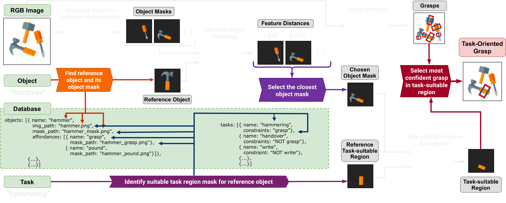
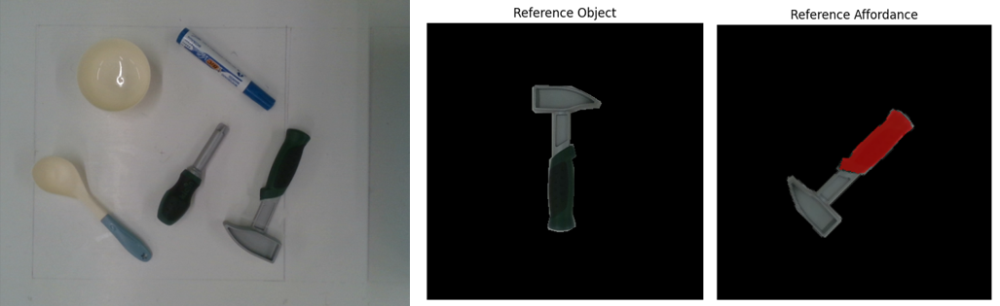
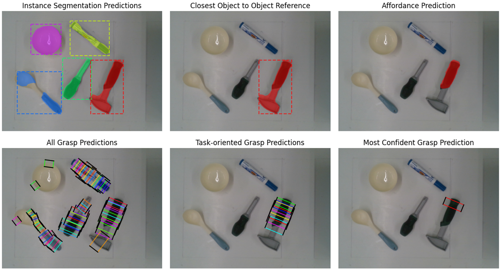

# One-shot Learning for Task-oriented Grasping
This repository contains the code implementation for the OS-TOG framework from the RA-L paper "One-shot Learning for Task-oriented Grasping". The One-shot Task-oriented Grasping (OS-TOG) framework comprises
four interchangeable neural networks that interact through
dependable reasoning components, resulting in a single system
that predicts multiple grasp candidates for a specific object
and task from multi-object scenes. Embedded one-shot learning
models leverage references within a database for OS-TOG to
generalize to both novel objects and tasks.

<p align="center">

</p>
<p align="center">
<a href="https://ieeexplore.ieee.org/document/10288069">IEEEXplore</a> | arXiv
</p>

## Getting Started
To use the framework, follow the set-up instructions below to install necessary libraries or model checkpoints. For training sub-models, you will need to download datasets. Notebooks have been provided for examples on inferencing and training the sub-models or the OS-TOG framework. Here is an overview of the folder structure: 

- [data/](data) - for dataset folders and annotation files.
- [libraries/](libraries) - for any external libraries used in code (i.e. AffCorrs).
- [os_tog/](os_tog) - contains the code of the repository.
- [notebooks/](notebooks) - contains example .ipynb notebooks for training and inferencing each sub-model of the framework and the framework itself.
- [models/](models) - for storing model checkpoints.

### Setting Up
Start by setting up a Python environment either locally or using Anaconda, and install __[PyTorch](https://pytorch.org/get-started/locally/)__. This code has been tested on Python 3.9.18 using CUDA 11.7 and PyTorch 2.0.1. Depending on the operating system you are using, install pydensecrf and faiss. For Windows, they can be installed using the following commands.
```
pip install git+https://github.com/lucasb-eyer/pydensecrf.git
pip install faiss-cpu
```

Then clone the repository and install the remaining dependencies  as follows.
```
git clone git+https://github.com/valerija-h/os_tog.git
cd os_tog/
pip install -r requirements.txt
```

Lastly, download the __[UCL-AffCorrs](https://github.com/RPL-CS-UCL/UCL-AffCorrs)__ library by following these commands, and rename it from ``UCL-AffCorrs`` to ``affcorrs``.
```
cd libraries/
git clone git+https://github.com/RPL-CS-UCL/UCL-AffCorrs.git
```

### Downloading Datasets
The final framework used the OCID_grasp dataset, the Cornell grasp dataset and the UMD affordance dataset for training its sub-models. These datasets can be download from the following links and should be placed in the `data/` directory. Note that after download them, you will have to generate JSON annotation files for them (see [Annotation Files](#annotation-files)).
- __OCID grasp__ - https://github.com/stefan-ainetter/grasp_det_seg_cnn
- __Cornell grasp__ - https://www.kaggle.com/datasets/oneoneliu/cornell-grasp
- __UMD affordance__ - https://users.umiacs.umd.edu/~fer/affordance/part-affordance-dataset/

### Downloading Model Checkpoints
The model checkpoints that were used in real-world experiments can be downloaded from __here__. If running the framework from the notebook it is recommended to create a directory for them in the `models/` directory (e.g. `models/os_tog/`) and check the paths in `config.py`.

### Code File Structure

Below is an overview of the code files found in the `os_tog/` directory:
- [config.py](os_tog/config.py) - configuration file for definining parameters for models, training scripts, datasets, etc.
- [dataset.py](os_tog/dataset.py) - contains functions for building dataset objects and annotation files, and includes data transformation functions.
- [framework.py](os_tog/framework.py) - pipeline for the OS-TOG framework.
- [model.py](os_tog/model.py) - contains functions for building and training sub-models of the framework.
- [utils.py](os_tog/utils.py) - contains functions for visualizing predictions.

## Annotation Files
To enable the use of several datasets including those not specified in this repository, all PyTorch dataset objects load annotations from JSON files that resemble the JSON structure of the __[COCO dataset](https://cocodataset.org/#format-data)__ for object detection. We extend this original format to also include annotations for grasps and affordances. 
Refer to [JSON_STRUCTURE.md](data/JSON_STRUCTURE.md) for an overview of this extended structure.

### Generating Annotation Files
Functions are provided in  `dataset.py` to generate JSON annotation files for datasets that were used to train the final framework used in real-world experiments. Below is a code snippet for generating a training annotation file for the OCID grasp dataset that can be added and executed in any of the notebooks in the `notebooks/` folder. The `dataset_path` is the root directory of the dataset and `save_path` is where the JSON annotation file will be saved. The `split` refers to the data split of the dataset, which varies depending on the dataset used. For the OCID grasp dataset there are two splits; "training" and "validation".

```python
import os_tog.dataset as d

dataset_path = "../data/OCID_grasp"
split = "training"
save_path = "../data/annotations/"

d.generate_COCO_from_OCID(dataset_path, split, save_path=save_path)
```
```
[INFO] Creating "training" annotations for the OCID grasp dataset (dataset_path: "../data/OCID_grasp") ...
[INFO] Processing result_2018-08-20-11-20-35.png: 100%|███████████████████████| 1411/1411 [01:58<00:00, 11.89it/s]
[INFO] Saving "training" annotation file at "../data/annotations/OCID_training_annotations.json".
```
## Real-world Experiments
This repository provides all the components that OS-TOG used in real-world experiments; the trained model checkpoints, a database of the objects used (images and annotations) and object mask annotations of the UMD part-affordance clutter dataset that were manually annotated to train and improve the performance of the instance segmentation model in multi-object settings. These additional components can be downloaded from __here__.

### Database and Annotation File
The image database and database annotation file used in physical experiments can be downloaded from __here__. The annotation file uses the following JSON structure below. Note that a sample scene to test inference is provided in `samples/example_scene.png`. You can try using OS-TOG on your own database by creating an annotation file that follows this structure and modifying the paths in `config.py`.

```json
{
    "objects"               : [object],
    "tasks"                 : [task]
}

task {
    "name"                  : str,
    "constraints"           : str
}

object {
    "name"                  : str,
    "img_path"              : str,
    "mask_path"             : str,
    "affordances"           : [aff]
}

aff {
    "name"                  : str,
    "mask_path"             : str
}
```

### Experimental Setup
The framework was evaluated in real-world scenes using 7-DoF robotic arm by Franka Emika mounted on a 110x100cm table and equipped with a D415 Intel RealSense camera that captures RGB-D images and custom 3D printed finger grippers. The RGB images were used by the framework to predict task-oriented grasps and the depth images were used for calculating the distance between the robotic gripper and the center of the predicted grasp pose. The robot was tasked with grasping objects on the left half og the table and placing them on the right half. The __[frankx](https://github.com/pantor/frankx)__ library was used for motion planning.

### Example Predictions
This section shows an example prediction when running OS-TOG for the target task __*hammering*__ and target object __*hammer*__. The input scene and the reference object and its reference affordance region (i.e. task-relevant grasping area) from the labelled database is shown below. As mentioned in the paper, the reference affordance is aligned close to the instance segmentation prediction to increase performance in affordance recognition.



Below are the predictions of each sub-model from OS-TOG, which results in the final task-relevant grasps and shows the most confident grasp show below.



## References
If using our method for your research, please cite:
```bibtex
@article{holomjova2023ostog,
    author={Holomjova, Valerija and Starkey, Andrew J. and Yun, Bruno and Meißner, Pascal},
    journal={IEEE Robotics and Automation Letters}, 
    title={One-Shot Learning for Task-Oriented Grasping}, 
    year={2023},
    volume={8},
    number={12},
    pages={8232-8238},
    doi={10.1109/LRA.2023.3326001}
}
```
Please also cite the original authors of any of the models or datasets if using them.